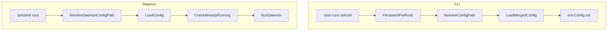

# Config Reference

Config file: `$XDG_CONFIG_HOME/sshush/config.toml` when `XDG_CONFIG_HOME` is set, otherwise `~/.config/sshush/config.toml`. Override with `-c` / `--config` or set `SSHUSH_CONFIG`.

**Config path resolution** (CLI): `--config` flag, then the default config path above if that file exists, then `$SSHUSH_CONFIG`, then `./config.toml`, else the default path. Daemon uses `$SSHUSH_CONFIG` or the same default path.

## Config Flow



See also: [Setup](setup.md) | [TUI](tui.md)

## Options

| Option | Description | Example |
|--------|-------------|---------|
| `socket_path` | Unix socket for the agent | `"$XDG_RUNTIME_DIR/sshush.sock"` when set, else `"~/.config/sshush/sshush.sock"` (or under `$XDG_CONFIG_HOME`) |
| `key_paths` | Paths to private keys to load | `["~/.ssh/id_ed25519", "~/.ssh/id_rsa"]` |

Example:

```toml
socket_path = "~/.config/sshush/sshush.sock"
key_paths   = ["~/.ssh/id_ed25519", "~/.ssh/id_rsa"]
```

CLI overrides: `-s` / `--socket` overrides `socket_path`.

## Theme

Optional `[theme]` section controls colours for CLI and TUI. You can use a preset name or custom hex colours.

**Preset** (name takes precedence over any hex keys):

```toml
[theme]
name = "dracula"
```

**Custom colours** (any subset; missing keys use the default theme):

```toml
[theme]
text    = "#585858"
focus   = "#7EE787"
accent  = "#F472B6"
error   = "#F87171"
warning = "#F2E94E"
```

**Preset names:** `default`, `dracula`, `nord`, `solarized-dark`, `catppuccin-mocha`.

Set theme from the CLI: `sshush theme show`, `sshush theme list`, `sshush theme set dracula`, or `sshush theme set --accent "#FF0000"`. In the TUI, press **t** to open the theme picker (bottom of screen); use **up/down** to preview, **s** to save to config, **esc** to cancel.

## Reload Behavior

`sshush reload` reconciles the running agent to the config file:

- Keys in `key_paths` that are not loaded are **added**
- Keys currently in the agent that are **not** in `key_paths` are **removed**
- Agent state is reset to match the config file

If `socket_path` changes in config, `reload` restarts the daemon with the new socket.
