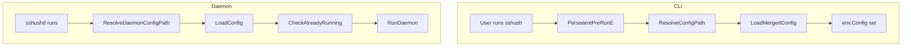

# Config Reference

Config file: `$XDG_CONFIG_HOME/sshush/config.toml` when `XDG_CONFIG_HOME` is set, otherwise `~/.config/sshush/config.toml`. Override with `-c` / `--config` or set `SSHUSH_CONFIG`.

To write that default file yourself (or emit it elsewhere), use `sshush generate config [path]`; omit `path` for the standard location. Add `--force` to replace an existing file.

**Config path resolution** (CLI): `--config` flag, then the default config path above if that file exists, then `$SSHUSH_CONFIG`, then `./config.toml` if it exists, else the default path. Daemon uses `$SSHUSH_CONFIG` or the same default path.

## Layout

Options are grouped into TOML tables:

| Section | Purpose |
|---------|---------|
| `[agent]` | Socket path, key paths, vault mode flag |
| `[vault]` | Vault file path (when `[agent].vault` is true) |
| `[server]` | TCP SSH server listen port and related paths |
| `[theme]` | Colours (preset or custom hex) |

### Migration from flat TOML (breaking)

Older releases used top-level keys. Move values into the tables above. CLI overrides (`-c`, `-s` / `--socket`, extra key paths on the command line) behave the same.

**Before (flat):**

```toml
socket_path = "~/.ssh/sshush.sock"
key_paths   = ["~/.ssh/id_ed25519"]
# vault_path = "~/.ssh/vault.json"

server_listen          = 2222
server_authorized_keys = "~/.ssh/authorized_keys"
server_host_key        = "~/.ssh/host_key"

[theme]
name = "dracula"
```

**After (sectioned):**

```toml
[agent]
socket_path = "~/.ssh/sshush.sock"
vault       = false
key_paths   = ["~/.ssh/id_ed25519"]

# [vault]
# vault_path = "~/.ssh/vault.json"

[server]
listen_port     = 2222
authorized_keys = "~/.ssh/authorized_keys"
host_key        = "~/.ssh/host_key"

[theme]
name = "dracula"
```

For vault-only use, set `[agent].vault = true`, put `vault_path` under `[vault]`, and omit or adjust `key_paths` as needed.

## Config Flow



See also: [Setup](setup.md) | [TUI](tui.md)

## `[agent]`

| Option | Description | Example |
|--------|-------------|---------|
| `socket_path` | Unix socket for the agent | `"$XDG_RUNTIME_DIR/sshush.sock"` when set, else `"~/.config/sshush/sshush.sock"` (or under `$XDG_CONFIG_HOME`) |
| `vault` | If true, use `[vault].vault_path` instead of loading only from `key_paths` | `true` / `false` |
| `key_paths` | Paths to private keys to load when not in vault-only mode (optional when `vault = true` if you add keys after unlock) | `["~/.ssh/id_ed25519"]` |

Example (in-memory keyring):

```toml
[agent]
socket_path = "~/.config/sshush/sshush.sock"
vault       = false
key_paths   = ["~/.ssh/id_ed25519", "~/.ssh/id_rsa"]
```

Example (vault mode):

```toml
[agent]
socket_path = "~/.ssh/sshush.sock"
vault       = true

[vault]
vault_path = "~/.ssh/vault.json"

[theme]
name = "dracula"
```

When `vault` is true, `key_paths` is optional (you add keys with `sshush add` after unlocking). You must set either `vault = true` with `[vault].vault_path`, or `vault = false` with `key_paths` present.

CLI overrides: `-s` / `--socket` overrides `[agent].socket_path`.

## `[vault]`

| Option | Description | Example |
|--------|-------------|---------|
| `vault_path` | Path to the vault file (plaintext JSON; private keys stored encrypted per-identity). Required when `[agent].vault` is true | `"~/.ssh/vault.json"` |

Do not set `[vault].vault_path` when `[agent].vault` is false.

## `[server]`

The TCP SSH server runs in a **separate daemon process** (not inside the agent). Start it with `sshush server` (or `sshush serve`), stop it with `sshush server stop`. It uses the same config file; no second config.

| Option | Description | Example |
|--------|-------------|---------|
| `listen_port` | TCP port (integer); omit or `0` = not enabled | `2222` |
| `authorized_keys` | Path to authorized_keys file; empty = use keys from the agent (and vault when vault mode is on) | `"~/.ssh/authorized_keys"` |
| `host_key` | Path to host private key file; empty = ephemeral in-memory key for this process | `"~/.ssh/sshush_host_ed25519"` |

```toml
[server]
listen_port = 2222
```

Paths support `~` expansion. Set `listen_port`, then run `sshush server` to start the server daemon. When using agent-backed auth (no `authorized_keys`), the agent must be running first: run `sshush start` before `sshush server`.

## Vault

When `[agent].vault` is true and `[vault].vault_path` points to a vault file, the daemon uses that file instead of loading keys only from `key_paths`. The vault is a single plaintext JSON file (e.g. `vault.json`) so you can inspect its structure; private key material is stored as encrypted blobs per-identity. The master key is derived from your passphrase and is wiped when you run `sshush lock`.

**One-time setup:**

1. Set `[agent].vault = true` and `[vault].vault_path` (e.g. `"~/.ssh/vault.json"`). If you give a directory, `vault.json` is used inside it.
2. Run `sshush vault init` (optionally `--vault-path ...` if not using config). Set and confirm a passphrase; a 24-word recovery phrase is generated by default (also written as `recovery.txt` next to the vault). Pass `--no-recovery` to skip.

**Master passphrase policy** (applies only at `vault init`, not when unlocking):

- The passphrase must be non-empty (whitespace-only is rejected).
- Minimum length defaults to 1 character (UTF-8 runes); additional rules (uppercase, lowercase, digits, ASCII specials) are defined in code as `DefaultPassphrasePolicy` in `internal/vault/passphrase_policy.go` and can be tightened over time.
- Unlock (`sshush start`, `sshush unlock`, recovery flow) does not re-check this policy so existing vaults keep working with passphrases created under older rules.

Strength checks are policy-based (length and character classes), not a statistical entropy estimate.

**Daily use:**

1. Start the agent: `sshush start` (you will be prompted for the passphrase to unlock the vault once per daemon session).
2. Add keys with the normal add command: `sshush add ~/.ssh/id_ed25519` (or `ssh-add - add`). There is no separate "vault add"; the same `sshush add` sends the key to the agent, and when the agent is a vault, it encrypts and stores it in the vault file.
3. Lock when done: `sshush lock`. While locked, the agent reports **no** identities (same as OpenSSH agent when locked). Unlock again with `sshush unlock`; if the vault is already unlocked, `sshush unlock` prints that and does not prompt for a passphrase.

If you start the daemon **without** vault mode, it uses the in-memory keyring and keys are never written to a vault file. To use the vault you must have `[agent].vault = true`, `[vault].vault_path` set, have run `vault init` once, and add keys with `sshush add` after unlocking.

If `ssh` still authenticates after lock, check that `SSH_AUTH_SOCK` points at sshush and that OpenSSH is not using another key via `IdentityFile` or a second agent (see `ssh -v`). Use `IdentitiesOnly` and agent-only identity settings if you need strict agent-only auth.

## Theme

Optional `[theme]` section controls colours for CLI and TUI. You can use a preset name or custom hex colours.

**Preset** (name takes precedence over any hex keys):

```toml
[theme]
name = "dracula"
```

**Custom colours** (any subset; missing keys use the default theme):

```toml
[theme]
text    = "#585858"
focus   = "#7EE787"
accent  = "#F472B6"
error   = "#F87171"
warning = "#F2E94E"
```

**Preset names:** `default`, `dracula`, `nord`, `solarized-dark`, `catppuccin-mocha`.

Set theme from the CLI: `sshush theme show`, `sshush theme list`, `sshush theme set dracula`, or `sshush theme set --accent "#FF0000"`. In the TUI, press **t** to open the theme picker (bottom of screen); use **up/down** to preview, **s** to save to config, **esc** to cancel.

## Reload Behavior

`sshush reload` reconciles the running agent to the config file:

- Keys in `[agent].key_paths` that are not loaded are **added**
- Keys currently in the agent that are **not** in `key_paths` are **removed**
- Agent state is reset to match the config file

If `[agent].socket_path` changes in config, `reload` restarts the daemon with the new socket.
