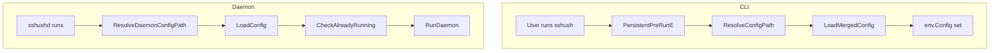

# Config Reference

Config file: `~/.config/sshush/config.toml`. Override with `-c` / `--config` or set `SSHUSH_CONFIG`.

**Config path resolution** (CLI): `--config` flag, then `~/.config/sshush/config.toml`, then `$SSHUSH_CONFIG`, then `./config.toml`. Daemon uses `$SSHUSH_CONFIG` or `~/.config/sshush/config.toml`.

## Config Flow



See also: [Setup](setup.md) | [TUI](tui.md)

## Options

| Option | Description | Example |
|--------|-------------|---------|
| `socket_path` | Unix socket for the agent | `"$XDG_RUNTIME_DIR/sshush.sock"` or `"~/.ssh/sshush.sock"` |
| `key_paths` | Paths to private keys to load | `["~/.ssh/id_ed25519", "~/.ssh/id_rsa"]` |

Example:

```toml
socket_path = "~/.ssh/sshush.sock"
key_paths   = ["~/.ssh/id_ed25519", "~/.ssh/id_rsa"]
```

CLI overrides: `-s` / `--socket` overrides `socket_path`.

## Reload Behavior

`sshush reload` reconciles the running agent to the config file:

- Keys in `key_paths` that are not loaded are **added**
- Keys currently in the agent that are **not** in `key_paths` are **removed**
- Agent state is reset to match the config file

If `socket_path` changes in config, `reload` restarts the daemon with the new socket.
