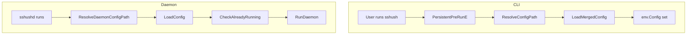

# Config Reference

Config file: `$XDG_CONFIG_HOME/sshush/config.toml` when `XDG_CONFIG_HOME` is set, otherwise `~/.config/sshush/config.toml`. Override with `-c` / `--config` or set `SSHUSH_CONFIG`.

To write that default file yourself (or emit it elsewhere), use `sshush generate config [path]`; omit `path` for the standard location. Add `--force` to replace an existing file.

**Config path resolution** (CLI): `--config` flag, then the default config path above if that file exists, then `$SSHUSH_CONFIG`, then `./config.toml` if it exists, else the default path. Daemon uses `$SSHUSH_CONFIG` or the same default path.

## Layout

Options are grouped into TOML tables:

| Section | Purpose |
|---------|---------|
| `[agent]` | Socket path, key paths, agent backend type |
| `[vault]` | Vault file path; required when `[agent].type` is `"vault"`, optional otherwise (for `sshush vault` CLI while the agent uses `key_paths`) |
| `[server]` | Optional TCP SSH server: off until `listen_port` is set; auth, host key, shell |
| `[theme]` | Colours (preset or custom hex) and plain output mode |

### Migration from flat TOML (breaking)

Older releases used top-level keys. Move values into the tables above. CLI overrides (`-c`, `-s` / `--socket`, extra key paths on the command line) behave the same.

**Checklist:**

1. Move `socket_path`, `key_paths`, and any vault flag into `[agent]`.
2. Add `type = "keys"` (or `"vault"` for vault mode) under `[agent]` — see [Migration from the `[agent].vault` boolean](#migration-from-the-agentvault-boolean-breaking) below if you already have `vault = true/false`.
3. Move `vault_path` into `[vault]` when you use vault mode or `sshush vault` CLI commands.
4. Rename server keys: `server_listen` → `[server].listen_port`, `server_authorized_keys` → `[server].authorized_keys`, `server_host_key` → `[server].host_key`.
5. Keep `[theme]` as-is.
6. Run `sshush reload` after editing, or restart with `sshush stop` then `eval $(sshush)`.

**Before (flat, master-era):**

```toml
socket_path = "~/.ssh/sshush.sock"
key_paths   = ["~/.ssh/id_ed25519"]

[theme]
name = "dracula"
```

**After (sectioned, keys-only agent):**

```toml
[agent]
socket_path = "~/.ssh/sshush.sock"
type        = "keys"
key_paths   = ["~/.ssh/id_ed25519"]

[theme]
name = "dracula"
```

**Before (flat with optional server):**

```toml
socket_path = "~/.ssh/sshush.sock"
key_paths   = ["~/.ssh/id_ed25519"]
# vault_path = "~/.ssh/vault.json"

server_listen          = 2222
server_authorized_keys = "~/.ssh/authorized_keys"
server_host_key        = "~/.ssh/host_key"

[theme]
name = "dracula"
```

**After (sectioned with server):**

```toml
[agent]
socket_path = "~/.ssh/sshush.sock"
type        = "keys"
key_paths   = ["~/.ssh/id_ed25519"]

# [vault]
# vault_path = "~/.ssh/vault.json"

[server]
listen_port     = 2222
authorized_keys = "~/.ssh/authorized_keys"
host_key        = "~/.ssh/host_key"

[theme]
name = "dracula"
```

For vault-only use, set `[agent].type = "vault"`, put `vault_path` under `[vault]`, and omit or adjust `key_paths` as needed.

To run the agent from `key_paths` but still point `sshush vault list` (and other vault commands) at a file, set `[agent].type = "keys"`, keep `key_paths`, and set `[vault].vault_path`. The daemon uses the keyring; vault commands use the file on disk.

### Migration from the `[agent].vault` boolean (breaking)

Older releases used `[agent].vault = true/false` plus (later) a separate `[agent].external = true/false`. Both were replaced by a single `[agent].type` string so the three backend modes are mutually exclusive by construction instead of by validation.

| Old | New |
|-----|-----|
| `vault = false` | `type = "keys"` |
| `vault = true` | `type = "vault"` |
| `external = true` | `type = "external"` |

`[agent].type` is now required; a config still using the old `vault`/`external` booleans without `type` fails to load with a clear error telling you to migrate.

## Config Flow


```mermaid
flowchart TD
  subgraph cliFlow [CLI]
    cliStart[User runs sshush]
    cliPreRun[PersistentPreRunE]
    cliResolve[ResolveConfigPath]
    cliLoad[LoadMergedConfig]
    cliEnv[env.Config set]
    cliStart --> cliPreRun --> cliResolve --> cliLoad --> cliEnv
  end
  subgraph daemonFlow [Daemon]
    dStart[sshushd runs]
    dResolve[ResolveDaemonConfigPath]
    dLoad[LoadConfig]
    dCheck[CheckAlreadyRunning]
    dRun[RunDaemon]
    dStart --> dResolve --> dLoad --> dCheck --> dRun
  end
```

See also: [Setup](setup.md) | [TUI](tui.md)

## `[agent]`

| Option | Description | Example |
|--------|-------------|---------|
| `socket_path` | Unix socket for the agent. Required for `type = "vault"`/`"keys"`. Optional for `type = "external"` — falls back to `SSH_AUTH_SOCK`, resolved fresh on every run. | `"$XDG_RUNTIME_DIR/sshush.sock"` when set, else `"~/.config/sshush/sshush.sock"` (or under `$XDG_CONFIG_HOME`) |
| `type` | Agent backend: `"keys"` (in-memory keyring from `key_paths`), `"vault"` (use `[vault].vault_path` as the backend), or `"external"` (socket_path points at an agent sshush does not own). Required. | `"keys"` / `"vault"` / `"external"` |
| `key_paths` | Paths to private keys to load when `type` is `"keys"` (optional for `"vault"` if you add keys after unlock; ignored for `"external"`) | `["~/.ssh/id_ed25519"]` |

Example (in-memory keyring):

```toml
[agent]
socket_path = "~/.config/sshush/sshush.sock"
type        = "keys"
key_paths   = ["~/.ssh/id_ed25519", "~/.ssh/id_rsa"]
```

Example (vault mode):

```toml
[agent]
socket_path = "~/.ssh/sshush.sock"
type        = "vault"

[vault]
vault_path = "~/.ssh/vault.json"

[theme]
name = "dracula"
```

When `type` is `"vault"`, `key_paths` is optional (you add keys with `sshush add` after unlocking). You must set either `type = "vault"` with `[vault].vault_path`, or `type = "keys"` with `key_paths` and/or `[vault].vault_path` present.

Example (external agent — sshush as a pure client of a foreign `ssh-agent`):

```toml
[agent]
type = "external"
```

`socket_path` is **optional** for `type = "external"` (required for `"vault"`/`"keys"`): a real `ssh-agent` picks a new socket path every time it starts (e.g. `/tmp/ssh-XXXXXXXXXX/agent.NNNN`), so a fixed path in config would go stale. When omitted, sshush resolves the socket from `SSH_AUTH_SOCK` fresh on every command — the normal way a shell that ran `eval $(ssh-agent)` already exposes it. Set `socket_path` explicitly instead if your external agent listens on a stable path (some system-integrated agents do).

With `type = "external"`, `sshush list`/`add`/`remove`/`lock`/`unlock` work against whatever agent is listening at `socket_path` (or `SSH_AUTH_SOCK`), but `sshush start`, `stop`, and `reload` refuse to start, stop, or restart anything there — start your own agent yourself.

CLI overrides: `-s` / `--socket` overrides `[agent].socket_path`.

## `[vault]`

| Option | Description | Example |
|--------|-------------|---------|
| `vault_path` | Path to the vault file (plaintext JSON; private keys stored encrypted per-identity). Required when `[agent].type` is `"vault"`; optional otherwise (for `sshush vault` CLI while the agent uses `key_paths`) | `"~/.ssh/vault.json"` |

When `[agent].type` is not `"vault"`, `[vault].vault_path` is optional and used only by `sshush vault` subcommands. The daemon ignores it and loads from `key_paths` instead.

## `[server]`

The TCP SSH server runs in a **separate daemon process** (not inside the agent). Start it with `sshush server` (or `sshush serve`), stop it with `sshush server stop`. It uses the same config file; no second config. It is **off until you enable it** — see [Enabling the server](#enabling-the-server).

| Option | Description | Example |
|--------|-------------|---------|
| `listen_port` | TCP port (integer). Unset or `0` = server off, the default; setting it is what enables the server | `2222` |
| `authorized_keys` | Path to authorized_keys file; empty = use keys from the agent (and vault when vault mode is on) | `"~/.ssh/authorized_keys"` |
| `host_key` | Path to host private key file; empty = `~/.config/sshush/server_host_ed25519` (under `$XDG_CONFIG_HOME` when set), created on first start | `"~/.ssh/sshush_host_ed25519"` |
| `shell` | Shell sessions run, as a path or a name on `PATH`; empty = the daemon's `$SHELL`, then `/bin/bash`, then `/bin/sh` | `"/bin/zsh"` |
| `password_auth` | `true` lets clients sign in with the vault's passphrase as well as a key; needs `[vault].vault_path`. Default `false` | `true` |

Paths support `~` expansion.

### Enabling the server

**The server is off until you turn it on.** Whoever signs in gets a shell as you, so starting it is left as a deliberate edit to your config: nothing runs the server until `[server].listen_port` is set.

The config sshush generates (on first run, or with `sshush generate config`) lists every `[server]` option, all commented out. Above each is a line saying what happens while it stays commented out:

```toml
# [server]
# The SSH server is off until you enable it: whoever signs in gets a shell as you,
# so turning it on should be a deliberate choice. To enable it, uncomment [server]
# and listen_port, then run 'sshush server'. Every other key is optional, and the
# comment above it says what happens while it stays commented out.
#
# TCP port to listen on. Unset or 0 keeps the server off.
# listen_port = 2222
#
# File of keys allowed to sign in. Unset: any key the running agent holds.
# authorized_keys = "~/.ssh/authorized_keys"
#
# The server's host key, created on first start if missing. Unset: this path.
# host_key = "~/.config/sshush/server_host_ed25519"
#
# Shell sessions run, as a path or a name on PATH. Unset: the server daemon's
# $SHELL, then /bin/bash, then /bin/sh.
# shell = "/bin/zsh"
#
# Also accept the vault's passphrase as an SSH password. Needs [vault].vault_path,
# and checking a password never unlocks the agent. Unset: false.
# password_auth = false
```

To enable the server, uncomment `[server]` and `listen_port`, then run `sshush server`:

```toml
[server]
listen_port = 2222
```

The other options can stay commented out until you want something other than the default.

Run `sshush server` before that and it does not start. It prints a warning naming the lines to change, then exits with status 1. `sshush server status` prints the same warning:

```text
SSH server is not enabled ([server].listen_port is unset or 0).
~/.config/sshush/config.toml:13: uncomment [server]
~/.config/sshush/config.toml:20: uncomment listen_port = 2222
Then run 'sshush server'.
```

The lines named are the ones in your file as it stands:
- a `listen_port` commented out inside a live `[server]` table: uncomment that line
- `listen_port = 0`: set a port on that line
- a `[server]` table with no `listen_port`: add one under its header
- no `[server]` table at all: add one

### Authorizing keys

With `authorized_keys` set, the file is read once at startup, and changing it needs a `sshush server stop` and `sshush server`.

With it unset, the server asks the agent on every connection. That has two consequences worth knowing:

- **The server can start before the agent.** It says so, and authorizes nobody until the agent is up — then picks it up on the next connection, with no restart.
- **`sshush reload`, `stop`/`start`, or an agent crash are survivable.** The server has no connection to lose, so a replaced agent is simply the one it asks next time.

`sshush server status` shows which of the two is in use and whether the agent is reachable.

### Password authentication

Set `password_auth = true` to let a client sign in with your vault's master passphrase instead of a key — from a machine that has none of yours loaded:

```toml
[vault]
vault_path = "~/.config/sshush/vault.json"

[server]
listen_port = 2222
password_auth = true
```

```bash
ssh -p 2222 -o PreferredAuthentications=password host
```

- **It checks the passphrase; it does not unlock anything.** The server reads the vault file, verifies the passphrase the way `sshush unlock` would, and throws the derived key away. The agent is never asked, so a locked agent stays locked — run `sshush unlock` inside the session if you need your keys there.
- **It needs an initialized vault.** `sshush server` refuses to start with `password_auth` on and no `[vault].vault_path`, or with a vault that has not been through `sshush vault init`. It works with any `[agent].type`, and with no agent running at all.
- **Guessing is slowed down.** Every wrong password costs the client a second. Five in a row from one address lock that address out of password authentication for a minute — the right passphrase is refused too while it lasts. At most two passphrase checks run at once, since each is a deliberately expensive key derivation. None of this touches public-key authentication.

It is off by default, and public keys keep working either way. Anyone who has the passphrase gets a shell as you, so turn it on only where you would expose that passphrase to the network, and prefer keys wherever you have them. `sshush server status` shows whether it is on.

### Host key

The server needs a stable identity, or every client that has connected before gets OpenSSH's host-key-changed warning on the next start. So the host key is a file, kept across restarts:

- With no `host_key` set, the server uses `~/.config/sshush/server_host_ed25519` (`$XDG_CONFIG_HOME/sshush/...` when that is set) and creates an ed25519 key there, mode `600`, the first time it starts. Nothing to set up.
- Set `host_key` to put it somewhere else — a path you already manage, or one shared between machines behind the same address. That file is created too if it does not exist yet, so `ssh-keygen` beforehand is optional.

The key lives in the config directory rather than the runtime directory on purpose: a host key under `$XDG_RUNTIME_DIR` would not survive a reboot, which is the problem it exists to solve.

`sshush server status` prints the path and the key's SHA256 fingerprint, in the same form `ssh` shows when asking about an unknown host, so you can compare the two rather than trusting the prompt.

### What a session gets

Connecting lands you in an interactive shell on the host, on a pty:

```bash
ssh -p 2222 host
```

The shell is `[server].shell` when that is set, and otherwise `$SHELL` as the server daemon inherited it, falling back to `/bin/bash` and then `/bin/sh`. A `shell` that cannot be found stops `sshush server` from starting, rather than failing every connection. It starts as a login shell, as with sshd, so it reads `~/.profile` (or `~/.bash_profile`, `~/.zprofile`, …) and not only the interactive rc file. `TERM` is taken from the client, terminal resizes are passed through, and the shell's exit code becomes the session's. Disconnecting takes the shell and everything it started with it — the server signals the shell's whole process group.

The session's environment is the daemon's own plus what sshd would set: `SSH_CLIENT`, `SSH_CONNECTION` and, on a pty, `SSH_TTY` describe this connection, and `SHELL` names the shell. `USER`, `LOGNAME` and `HOME` are filled in if the daemon was started without them. Variables the client sends (`SendEnv`) are ignored, and `/etc/environment` is not read: the daemon runs as you, and already inherits the environment your own login set up.

**Every authorized key gets a shell as the user running `sshushd`.** There is no per-key OS identity and no restricted mode: the server is single-user by design, so treat `[server].authorized_keys` (or the keys in your agent) as the full list of people you would hand that account to.

Connecting with a command runs that instead, handed to the shell as `$SHELL -c <command>` the way sshd does it, so pipes, globs and quoting behave as they would locally:

```bash
ssh -p 2222 host 'ls | wc -l'
```

A command gets a pty only when asked for one (`ssh -t`); otherwise its stdout and stderr come back separately and your stdin is relayed to it. Its exit code becomes the session's. The session ends once the command and anything still holding its output have finished — so, as with sshd, a background job left writing to the session keeps it open. Redirect its output (`nohup cmd >/dev/null 2>&1 &`) to leave it running on its own.

Everything else is refused promptly rather than by hanging:

- **Port forwarding** (`-L`, `-D`, `-W`) is refused with a message the client prints: `open failed: administratively prohibited: sshush server does not support port forwarding`. Remote forwards (`-R`) are refused too, though the protocol gives that refusal no room for a reason.
- **`sftp`**, and so plain `scp`, which runs over it, fails with `subsystem request failed`.
- **Agent forwarding** (`-A`) is not provided. The protocol lets the request succeed, but no agent is ever forwarded: the session sees whatever `SSH_AUTH_SOCK` the daemon itself started with, if any.

## Vault

When `[agent].type` is `"vault"` and `[vault].vault_path` points to a vault file, the daemon uses that file instead of loading keys only from `key_paths`. The vault is a single plaintext JSON file (e.g. `vault.json`) so you can inspect its structure; private key material is stored as encrypted blobs per-identity. The master key is derived from your passphrase and is wiped when you run `sshush lock`.

**One-time setup:**

1. Set `[agent].type = "vault"` and `[vault].vault_path` (e.g. `"~/.ssh/vault.json"`). If you give a directory, `vault.json` is used inside it.
2. Run `sshush vault init` (optionally `--vault-path ...` if not using config). Set and confirm a passphrase; a 24-word recovery phrase is generated by default (also written as `recovery.txt` next to the vault). Pass `--no-recovery` to skip.

**Master passphrase policy** (applies only at `vault init`, not when unlocking):

- The passphrase must be non-empty (whitespace-only is rejected).
- Minimum length defaults to 1 character (UTF-8 runes); additional rules (uppercase, lowercase, digits, ASCII specials) are defined in code as `DefaultPassphrasePolicy` in `internal/vault/passphrase_policy.go` and can be tightened over time.
- Unlock (`sshush start`, `sshush unlock`, recovery flow) does not re-check this policy so existing vaults keep working with passphrases created under older rules.

Strength checks are policy-based (length and character classes), not a statistical entropy estimate.

**Daily use:**

1. Start the agent: `sshush start` (you will be prompted for the passphrase to unlock the vault once per daemon session).
2. Add keys with the normal add command: `sshush add ~/.ssh/id_ed25519` (or `ssh-add - add`). There is no separate "vault add"; the same `sshush add` sends the key to the agent, and when the agent is a vault, it encrypts and stores it in the vault file.
3. Lock when done: `sshush lock`. While locked, the agent reports **no** identities (same as OpenSSH agent when locked). Unlock again with `sshush unlock`; if the vault is already unlocked, `sshush unlock` prints that and does not prompt for a passphrase.

If you start the daemon **without** vault mode, it uses the in-memory keyring and keys are never written to a vault file. To use the vault you must have `[agent].type = "vault"`, `[vault].vault_path` set, have run `vault init` once, and add keys with `sshush add` after unlocking.

If `ssh` still authenticates after lock, check that `SSH_AUTH_SOCK` points at sshush and that OpenSSH is not using another key via `IdentityFile` or a second agent (see `ssh -v`). Use `IdentitiesOnly` and agent-only identity settings if you need strict agent-only auth.

## Theme

Optional `[theme]` section controls colours for CLI and TUI. You can use a preset name or custom hex colours.

| Option | Description | Example |
|--------|-------------|---------|
| `no_color` | Disable colours and fancy output (plain ASCII). Also via `--no-color` flag or `NO_COLOR` env var. | `true` / `false` |

**Preset** (name takes precedence over any hex keys):

```toml
[theme]
name = "dracula"
```

**Custom colours** (any subset; missing keys use the default theme):

```toml
[theme]
text    = "#585858"
focus   = "#7EE787"
accent  = "#F472B6"
error   = "#F87171"
warning = "#F2E94E"
```

**Preset names:** `default`, `dracula`, `nord`, `solarized-dark`, `catppuccin-mocha`.

Set theme from the CLI: `sshush theme show`, `sshush theme list`, `sshush theme set dracula`, or `sshush theme set --accent "#FF0000"`. In the TUI, press **t** to open the theme picker (bottom of screen); use **up/down** to preview, **s** to save to config, **esc** to cancel.

## Reload Behavior

`sshush reload` reconciles the running agent to the config file:

- Keys in `[agent].key_paths` that are not loaded are **added**
- Keys currently in the agent that are **not** in `key_paths` are **removed**
- Agent state is reset to match the config file

If `[agent].socket_path` changes in config, `reload` restarts the daemon with the new socket.
