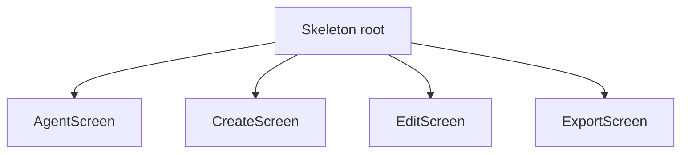

# TUI Architecture

This document describes the sshush TUI architecture: model hierarchy, message flow, component mapping, and Init/Update/View responsibilities.

See also: [Config](config.md) | [Setup](setup.md)

## Model Hierarchy



Text view:

```
Skeleton (root)
├── AgentScreen   (page 0: Agent tab)
├── CreateScreen  (page 1: Create tab)
├── EditScreen    (page 2: Edit tab)
└── ExportScreen  (page 3: Export tab)
```

- **Skeleton**: Layout shell with tabs, header, footer, help overlay. Owns pages and widgets. Routes input to the active page.
- **AgentScreen**: Manages keys in the SSH agent. Table of loaded keys, buttons (Start/Stop/Reload), found keys, file picker for adding, passphrase for lock/unlock.
- **CreateScreen**: Key generation form. Key type, options, comment, directory, filename, save button.
- **EditScreen**: Edit key comments. Load from file or agent, edit comment, save.
- **ExportScreen**: Export public keys. Load from file or agent, copy to clipboard or save to file.

## Message Flow

Messages flow from tea.Cmd functions to Update. Custom message types carry async results.

### Agent Screen

| Message | Source Cmd | Purpose |
|---------|------------|---------|
| agentKeysMsg | fetchAgentKeysCmd | Keys loaded from socket (or error) |
| agentStatusMsg | startDaemonCmd, stopDaemonCmd, reloadDaemonCmd, addKeyToAgentCmd, removeKeyFromAgentCmd | Status text for banner |
| agentDaemonStateMsg | checkDaemonCmd | Daemon running/stopped |
| foundKeysMsg | discoverKeysCmd | Discovered key paths from config |
| agentLockResultMsg | lockAgentCmd | Lock result |
| agentUnlockResultMsg | unlockAgentCmd | Unlock result |
| ButtonFlashDoneMsg | ButtonFlashCmd | Button flash animation done |

### Create Screen

| Message | Source Cmd | Purpose |
|---------|------------|---------|
| keyGenDoneMsg | key generation Cmd | Key created (or error) |

### Edit Screen

| Message | Source Cmd | Purpose |
|---------|------------|---------|
| editKeyLoadedMsg | load key from file | Key loaded (or error) |
| editAgentKeysMsg | fetch agent keys | Keys from agent for selection |
| editSaveMsg | save Cmd | Save result |

### Export Screen

| Message | Source Cmd | Purpose |
|---------|------------|---------|
| exportKeyLoadedMsg | load key from file | Key loaded (or error) |
| exportAgentKeysMsg | fetch agent keys | Keys from agent for selection |
| exportCopyMsg | copy to clipboard | Copy result |
| exportSaveMsg | save to file | Save result |

### Layout

| Message | Purpose |
|---------|---------|
| NavToTabBarMsg | Move focus to tab bar |
| tea.WindowSizeMsg | Resize handled by Skeleton and forwarded to active page |
| tea.KeyPressMsg, tea.MouseReleaseMsg | Routed by Skeleton to active page or tab bar |

## Component Mapping

| Component | Package | Used In | Purpose |
|-----------|---------|---------|---------|
| table | charm.land/bubbles/v2/table | AgentScreen, EditScreen, ExportScreen (KeyTable) | Display key lists |
| textinput | charm.land/bubbles/v2/textinput | CreateScreen, EditScreen, ExportScreen | Comment, directory, filename, passphrase |
| filepicker | charm.land/bubbles (StyledFilePicker) | AgentScreen, EditScreen, ExportScreen | Select key files |
| ButtonRow | internal/tui/components | All screens | Action buttons (key type, Start/Stop, Save, etc.) |
| KeyTable | internal/tui/components | AgentScreen, EditScreen, ExportScreen | Table + zone markup |
| Lipgloss | charm.land/lipgloss | theme.go, all View() | Styling, layout |

## Init / Update / View Responsibilities

### Skeleton

- **Init**: Batches Init() of all pages.
- **Update**: Handles tab switching, NavToTabBarMsg, WindowSizeMsg. Forwards screen-specific messages to the active page (e.g. agentKeysMsg only to page 0).
- **View**: Renders tab bar, header, footer, help overlay, and delegates content to active page's View().

### AgentScreen

- **Init**: fetchAgentKeysCmd, checkDaemonCmd, discoverKeysCmd.
- **Update**: Handles agentKeysMsg, agentStatusMsg, agentDaemonStateMsg, foundKeysMsg, lock/unlock results, key/button/mouse input.
- **View**: Loaded keys table (primary, centered), found keys section below, file picker or passphrase input when active.

#### Agent navigation

Skeleton has three nav layers: tab bar (`navFocusTabs`), screen content (`navFocusScreen`), and daemon controls in the header (`navFocusDaemon`, entered with `d` when not removing a key).

On the Agent tab with screen focus, the **Loaded Keys** table is the default focus (`agentFocusTable`). Entering the screen from the tab bar (`down`/`j`/`enter`) selects the first loaded key immediately; the bordered box is display-only.

| Key | Table focused | Found Keys focused |
|-----|---------------|-------------------|
| `up` / `k` | Move cursor up; at first row, return to tab bar | Move selection up; at top, return to table |
| `down` / `j` | Move cursor down; at last row, enter Found Keys (if any) | Move selection down (clamped to visible rows) |
| `backspace` / `delete` / `d` | Remove selected loaded key | — |
| Click row | Select row in table | Click found line adds key (unchanged) |

`d` removes the selected loaded key when the Agent table is focused. On other tabs, when Found Keys is focused, or when a modal is open, `d` enters daemon controls instead.

Loaded keys and Found Keys share the same section layout: title, bordered box at 3/4 content width. The loaded keys block is vertically centered in the screen content area.

### CreateScreen

- **Init**: None (form is static initially).
- **Update**: Handles keyGenDoneMsg, form input (type, options, comment, dir, filename), save.
- **View**: Key type row, options row, comment input, dir input, filename input, save button.

### EditScreen

- **Init**: None.
- **Update**: Handles editKeyLoadedMsg, editAgentKeysMsg, editSaveMsg, file picker, agent table, comment input.
- **View**: Load-from-file / load-from-agent, comment input, save button.

### ExportScreen

- **Init**: None.
- **Update**: Handles exportKeyLoadedMsg, exportAgentKeysMsg, exportCopyMsg, exportSaveMsg, file picker, agent table.
- **View**: Load source, pub key display, copy/save actions.
