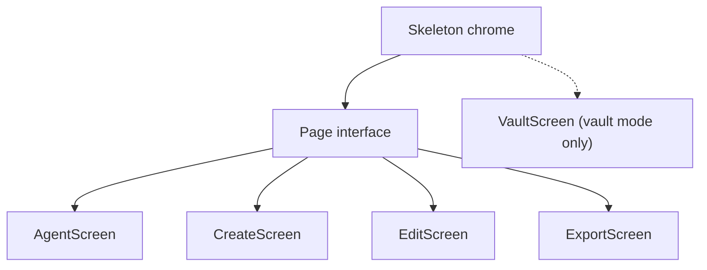

# TUI Architecture

This document describes the sshush TUI architecture: model hierarchy, message flow, component mapping, and Init/Update/View responsibilities.

See also: [Config](config.md) | [Setup](setup.md)

## Model Hierarchy



Text view:

```
Skeleton (chrome only)
├── AgentScreen   (page id "agent")
├── CreateScreen  (page id "create")
├── EditScreen    (page id "edit")
├── ExportScreen  (page id "export")
└── VaultScreen   (page id "vault"; registered only when [agent].type = "vault" and [vault].vault_path is set)
```

- **Skeleton**: Tabs, theme picker, help overlay, outer border/footer. Routes keys/mouse to the active page. Does not own daemon button logic (see `agent_chrome.go`).
- **AgentScreen**: Keys table, found keys, file picker, passphrase, comment overlay. Implements `HeaderTools` and `GlobalHotkeys` (`s/x/r/L/u/d`).
- **CreateScreen / EditScreen / ExportScreen**: Forms and actions using shared `FocusRing`, `KeyMap`, `SectionWidth`, `ButtonRow`.
- **VaultScreen**: Vault identity management, mirroring `sshush vault` subcommands. Only registered when `[agent].type = "vault"` and `[vault].vault_path` is set (never for `"external"`, even if `vault_path` happens to be set); the tab bar shows no Vault entry otherwise. The Agent tab remains page 0 and the default landing tab in every mode. Does not implement `HeaderTools`/`GlobalHotkeys`; claims its own row-delete `d` via `HandleDKey` instead (see Event order below).

### Page contracts (`page.go`)

| Interface | Methods |
|-----------|---------|
| **Page** | `tea.Model`, `HasModal() bool`, `HasActiveTextInput() bool`, `StatusTextRaw() (string, bool)` |
| **HelpProvider** | `HelpEntries() []string` |
| **HeaderTools** | `HeaderToolsView(focused bool) string`, `HeaderToolsFocused() bool`, `HeaderToolsUpdate(msg tea.Msg) tea.Cmd`, `HeaderToolsHandleMouse(x, y int) (handled bool, cmd tea.Cmd)` |
| **GlobalHotkeys** | `HandleGlobalKey(key string, pageActive bool) (handled bool, cmd tea.Cmd, side tea.Msg)` |
| **AsyncMsgRouter** | `HandlesAsync(msg tea.Msg) bool` |
| **ScreenEnter** | `OnScreenEnter()` |

`side` from `HandleGlobalKey` is a chrome message Skeleton applies in the same Update turn (e.g. `ActivateHeaderToolsMsg`). `VaultStateMsg` is unidirectional Agent → Skeleton for the footer vault padlock.

`HandleDKey() (tea.Cmd, bool)` is a separate, narrower ad-hoc hook (not part of `page.go`) that lets a page claim the `d` key for its own row-delete action; it takes priority over `AgentScreen`'s global `d` hotkey (see Event order).

Chrome nav focus for header tools is `navFocusHeaderTools` (`navFocusDaemon` remains an alias for older tests).

## Event order

1. Help / theme overlays (Skeleton)
2. Modal open on active page → page owns keys (except ctrl+c)
3. Header tools focused (`navFocusHeaderTools`) → `HeaderToolsUpdate`
4. `d` key, active page implements `HandleDKey` → page claims it (e.g. `VaultScreen` row delete), else falls through to global hotkeys
5. Global hotkeys (`HandleGlobalKey`) when not in text input / theme-picker save conflict
6. Tab bar chrome keys, else forward to active page `Update` (screen FocusRing / custom focus)
7. Async messages → pages that `HandlesAsync(msg)` (else active page)

Mouse: chrome zones first; then `HeaderToolsHandleMouse` (handled miss returns `false`); else page.

## Focus and keys

- **FocusRing** (`focus.go`): index-based slots via `NewFocusRing(n)`, `SetSkip`, `SetIndex`, `Next` / `Prev` (and no-wrap variants). Create/Edit/Export use this; they do not store `Focusable` items. `Focusable` exists for optional richer wrappers later. `AgentScreen` and `VaultScreen` still use a manual `focus int` field, not `FocusRing`.
- **KeyMap** (`keymap.go`): shared bindings (`KeyUp`/`KeyDown`/…, daemon keys). Prefer `KeyMatches` / `KeyMatchesString` over raw string switches.
- **Layout** (`layout.go`): `ContentWidth`, `SectionWidth` (3/4 content, clamp 60–120), `SectionInnerWidth`, `SectionGap`.

Zone IDs: `{pagePrefix}{kind}-{id}` (e.g. ButtonRow `ZonePrefix+label`, agent rows `{prefix}key-N`).

## Testing

- **Package `tui`**: Update-injection tests next to screens (`agent_nav_test.go`, `create_test.go`, `edit_test.go`, `export_focus_test.go` / `export_nav_test.go`, `focus_test.go`, `skeleton_footer_test.go`).
- **`internal/tui/tuittest`**: harness for external packages that must import `tui` without cycles (`Harness.Send` / `Resize` / `Key`, `WaitForZone`).

Official Charm `teatest` targets Bubbletea v1; this project uses Bubbletea v2, so keep Update-injection until a v2-compatible path exists.

## Message Flow

Messages flow from tea.Cmd functions to Update. Custom message types carry async results.

### Chrome

| Message | Purpose |
|---------|---------|
| NavToTabBarMsg | Move focus to tab bar |
| ActivateHeaderToolsMsg | Focus header tools / ensure agent tab |
| ExitHeaderToolsMsg | Leave header tools; restore prior tab |
| VaultStateMsg | Footer vault lock display (Agent → Skeleton) |
| ThemeChangedMsg | Refresh styles on all pages |

### Agent Screen

| Message | Source Cmd | Purpose |
|---------|------------|---------|
| agentKeysMsg | fetchAgentKeysCmd | Keys loaded from socket (or error) |
| agentStatusMsg | start/stop/reload/add/remove cmds | Status text for banner |
| agentDaemonStateMsg | checkDaemonCmd | Daemon running/stopped |
| foundKeysMsg | discoverKeysCmd | Discovered key paths from config |
| agentLockResultMsg | lockAgentCmd | Lock result |
| agentUnlockResultMsg | unlockAgentCmd | Unlock result |
| ButtonFlashDoneMsg | ButtonFlashCmd | Button flash animation done |
| commentOverlaySavedMsg | saveCommentOverlayCmd | Comment edit save result (see below) |

**Comment overlay**: pressing `e` on a selected key in the loaded-keys table opens a
small comment-edit overlay. Saving resolves the key's source file from the agent's
filepath registry, writes the new comment to the key file (and `.pub` companion if
present), persists it to the vault when the agent is vault-backed, and reloads the
key in the agent. See `internal/tui/comment_overlay.go`.

### Create / Edit / Export

| Message | Source Cmd | Purpose |
|---------|------------|---------|
| keyGenDoneMsg | key generation Cmd | Key created (or error) |

### Edit Screen

| Message | Source Cmd | Purpose |
|---------|------------|---------|
| editKeyLoadedMsg | load key from file | Key loaded (or error) |
| editAgentKeysMsg | fetch agent keys | Keys from agent for selection |
| editSaveMsg | save Cmd | Save result |

### Export Screen

| Message | Source Cmd | Purpose |
|---------|------------|---------|
| exportKeyLoadedMsg | load key from file | Key loaded (or error) |
| exportAgentKeysMsg | fetch agent keys | Keys from agent for selection |
| exportCopyMsg | copy to clipboard | Copy result |
| exportSaveMsg | save to file | Save result |

### Vault Screen

| Message | Source Cmd | Purpose |
|---------|------------|---------|
| vaultIdentitiesMsg | listVaultIdentitiesCmd | Vault identities loaded from the on-disk store, cross-referenced against the running agent's loaded keys for the LOADED column (or error) |
| vaultOpResultMsg | addVaultKeyCmd, removeVaultIdentityCmd, sessionLoadVaultCmd, setVaultAutoloadCmd, unlockVaultPassphraseCmd, unlockVaultRecoveryCmd, vaultLockCmd | Result of an add/remove/session-load/autoload-toggle/unlock/lock op; success re-triggers listVaultIdentitiesCmd |
| vaultInitResultMsg | initVaultCmd | Result of vault initialization; carries the recovery mnemonic and recovery.txt path when recovery was generated |
| ButtonFlashDoneMsg | ButtonFlashCmd | Button flash animation done |

VaultScreen does not poll vault lock state itself: it reads `Skeleton.vaultMode` / `vaultLocked` / `vaultKnown`, which AgentScreen keeps current via its own `checkVaultStateCmd` poll (these fields are shared Skeleton state, updated regardless of which tab is active). Vault-specific messages route only to the active tab (the default Skeleton fallthrough), unlike the Agent screen's messages, which are hard-routed to page 0 regardless of active tab.

Because of that routing, VaultScreen implements `Refresh() tea.Cmd` (returning `listVaultIdentitiesCmd`), which `Skeleton.switchTab` calls whenever a page implementing it becomes active. This re-lists identities on every switch to the Vault tab, so state changed elsewhere — e.g. the vault unlocked from the Agent tab's own lock/unlock, or a key added before this VaultScreen instance's own `Init()` had a chance to run — is picked up instead of showing whatever (possibly empty or locked-at-the-time) snapshot `Init()` captured at TUI startup.

### Layout

| Message | Purpose |
|---------|---------|
| NavToTabBarMsg | Move focus to tab bar |
| tea.WindowSizeMsg | Resize handled by Skeleton and forwarded to active page |
| tea.KeyPressMsg, tea.MouseReleaseMsg | Routed by Skeleton to active page or tab bar |

## Component Mapping

| Component | Package | Used In | Purpose |
|-----------|---------|---------|---------|
| table | charm.land/bubbles/v2/table | AgentScreen, EditScreen, ExportScreen (KeyTable), VaultScreen | Display key/identity lists |
| textinput | charm.land/bubbles/v2/textinput | CreateScreen, EditScreen, ExportScreen, VaultScreen, AgentScreen (passphrase) | Comment, directory, filename, passphrase, recovery phrase |
| filepicker | charm.land/bubbles (StyledFilePicker) | AgentScreen, EditScreen, ExportScreen, VaultScreen | Select key files |
| ButtonRow | internal/tui/components | All screens | Action buttons (key type, Start/Stop, Save, etc.) |
| KeyTable | internal/tui/components | AgentScreen, EditScreen, ExportScreen | Table + zone markup (3 columns: type/fingerprint/comment) |
| FocusRing | internal/tui | CreateScreen, EditScreen, ExportScreen | Focus order (see Focus and keys above) |
| Lipgloss | charm.land/lipgloss/v2 | theme.go, all View() | Styling, layout |

VaultScreen's identity table needs 5 columns (fingerprint/loaded/autoload/comment/type), so it uses `charm.land/bubbles/v2/table` directly rather than the 3-column `KeyTable` wrapper, styled via the same `keyTableStyles` helper so colors and selection highlighting match exactly. Row-click hit testing reuses the single-zone-plus-offset technique from `KeyTable.HandleMouse` (mark the whole table view, compute the row from the click's Y offset) instead of per-row zone marks.

## Init / Update / View Responsibilities

### Skeleton

- **Init**: Batches Init() of all pages.
- **Update**: Chrome (tabs, theme, help, `navFocusHeaderTools`). Applies `VaultStateMsg` to footer. Forwards via Page / HeaderTools / GlobalHotkeys / AsyncMsgRouter (`agent_chrome.go` for Agent).
- **View**: Tab bar + optional `HeaderToolsView`, footer, help; body = active page View.

### AgentScreen

- **Init**: fetch keys, daemon, vault, discover.
- **Update**: agent msgs, table/found/passphrase/file picker.
- **View**: Loaded keys (centered), found keys; modals when active.
- **Header tools**: entered with `d` (unless removing a selected loaded key). `s/x/r/L/u` work from any tab via GlobalHotkeys.

| Key | Table focused | Found Keys focused |
|-----|---------------|-------------------|
| `up` / `k` | Move cursor up; at first row, return to tab bar | Move selection up; at top, return to table |
| `down` / `j` | Move cursor down; at last row, enter Found Keys (if any) | Move selection down (clamped to visible rows) |
| `backspace` / `delete` / `d` | Remove selected loaded key | — |
| Click row | Select row in table | Click found line adds key (unchanged) |

`d` removes the selected loaded key when the Agent table is focused. On other tabs, when Found Keys is focused, or when a modal is open, `d` enters daemon controls instead — unless the active page implements `HandleDKey() (tea.Cmd, bool)` and claims the key itself (VaultScreen does this for its own identity table; see VaultScreen below).

Loaded keys and Found Keys share the same section layout: title, bordered box at 3/4 content width. The loaded keys block is vertically centered in the screen content area.

### CreateScreen

FocusRing: Type → Options (skip for ed25519) → Comment → Dir → Filename → Save.

### EditScreen

FocusRing: Select file → Comment → Save (comment/save skipped until a key is loaded).

### ExportScreen

- **Init**: None.
- **Update**: Handles exportKeyLoadedMsg, exportAgentKeysMsg, exportCopyMsg, exportSaveMsg, file picker, agent table.
- **View**: Load source, pub key display, copy/save actions.
- FocusRing: Load file → Load agent → (agent table modal) → Pub key → Copy → Save. Copy/Save use `ButtonRow`.

### VaultScreen

- **Init**: listVaultIdentitiesCmd.
- **Update**: Handles vaultIdentitiesMsg, vaultOpResultMsg, vaultInitResultMsg, key/button/mouse input, file picker, passphrase input (init and passphrase-unlock share one two-step flow), recovery-phrase input, and the one-time post-init recovery-phrase display modal.
- **View**: Identity table (primary, centered, bordered — warn-colored border when the shared vault lock state is locked), button row below, vault path footer line; file picker, passphrase modal, recovery-phrase input modal, or recovery-phrase display modal in place of the table when active.

The identity table renders each row manually (`renderVaultTableRow`/`vaultTableStyles`, reusing `keyTableStyles`) instead of calling `table.Model.View()` directly, so the selected row gets the same full-row background highlight as AgentScreen's KeyTable — not bubbles/table's own `> `-prefixed cursor indicator.

#### Vault navigation

VaultScreen has two focus states, `vaultFocusTable` and `vaultFocusButtons`, unlike AgentScreen (whose buttons are keyboard/mouse-only, never arrow-reachable): pressing `down`/`j` at the last table row moves focus to the button row instead of stopping, and `up`/`k` from the button row returns to the table. `left`/`right` move the active button only while the button row has focus; `enter` presses it.

| Key | Table focused | Buttons focused |
|-----|----------------|------------------|
| `up` / `k` | Move cursor up; at first row, return to tab bar | Return focus to table |
| `down` / `j` | Move cursor down; at last row, move focus to buttons | — |
| `left` / `right` | — | Move active button |
| `enter` | — | Press active button |
| `i` | Init vault (only relevant — and only shown as a button — before the vault at `vaultPath` is initialized; two-step passphrase + confirm; recovery phrase generated and shown once on success) |
| `I` | Init vault with no recovery phrase, the tab's `--no-recovery`. The passphrase becomes the only way in. No button, for the same reason as `A` |
| `a` | Add key (opens file picker; adds with autoload on) |
| `A` | Add key with autoload off, the tab's `--no-autoload` (session only: the agent forgets it on restart). No button — the row is already nine wide, and this is the rarer choice |
| `d` / `backspace` / `delete` | Remove selected identity (permanent — reaches VaultScreen via `HandleDKey`, since Skeleton's global `d` key is otherwise reserved for entering daemon focus on every tab but Agent's) |
| `o` | Session-load selected identity (for autoload-off identities) |
| `+` / `-` | Turn autoload on / off for the selected identity |
| `U` | Unlock with passphrase (capitalized — lowercase `u` is Skeleton's global "unlock the agent from any tab" hotkey, which would jump to the Agent tab) |
| `R` | Unlock with 24-word recovery phrase |
| `l` | Lock the vault, no passphrase needed (lowercase — capital `L` is Skeleton's global agent-lock hotkey, reserved for the same reason as `u`/`U` above) |
| Click row | Select row in table | |
| Click button | Same as the corresponding shortcut key | |

The button row itself is rebuilt on every render from `visibleButtons()`/`syncButtons()` rather than being a fixed list, so it can react to state:
- **Init** only appears before the vault at `vaultPath` is initialized (tracked via `vaultIdentitiesMsg.initialized`, set from whether `vault.Open` finds existing metadata — a missing/uninitialized vault is not treated as an error).
- **Unlock** and **Recovery** grey out once the shared vault lock state (`Skeleton.vaultKnown`/`vaultLocked`, kept current by AgentScreen's poll) reports the vault already unlocked; **Lock** greys out once it reports the vault already locked. Neither greys out while the lock state is unknown (e.g. daemon not running). The `U`/`R`/`l` shortcut keys honor the same guard, not just the buttons.

Every add/remove/session-load/autoload-toggle/unlock/lock op re-runs listVaultIdentitiesCmd on success so the table and LOADED/autoload columns stay current. VaultScreen never runs its own vault-lock-state poll; it reads the poll AgentScreen already runs (see Message Flow above).

**Remove semantics differ between the Agent tab and the Vault tab for a vault-backed agent.** The Agent tab's remove (`d`/`backspace` on the Loaded Keys table) calls the session-unload operation over `sshush-op` (`internal/vault/agent.go`'s `sessionUnload`), which hides the identity from the running agent session only — the Vault tab's LOADED column flips to "no" — without touching its persisted `autoload` flag or deleting it. Only the Vault tab's own remove action (and the CLI's `sshush vault remove`) permanently deletes an identity, via the plain ssh-agent `Remove` RPC. This split exists because the SSH agent protocol's `Remove` has no "just hide it" concept, but treating a routine Agent-tab key removal as permanent deletion for vault-backed agents was surprising and destructive.
