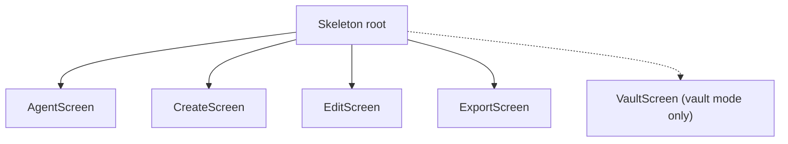

# TUI Architecture

This document describes the sshush TUI architecture: model hierarchy, message flow, component mapping, and Init/Update/View responsibilities.

See also: [Config](config.md) | [Setup](setup.md)

## Model Hierarchy



Text view:

```
Skeleton (root)
├── AgentScreen   (page 0: Agent tab)
├── CreateScreen  (page 1: Create tab)
├── EditScreen    (page 2: Edit tab)
├── ExportScreen  (page 3: Export tab)
└── VaultScreen   (page 4: Vault tab; registered only when agentBackendMode == "vault")
```

- **Skeleton**: Layout shell with tabs, header, footer, help overlay. Owns pages and widgets. Routes input to the active page.
- **AgentScreen**: Manages keys in the SSH agent. Table of loaded keys, buttons (Start/Stop/Reload), found keys, file picker for adding, passphrase for lock/unlock.
- **CreateScreen**: Key generation form. Key type, options, comment, directory, filename, save button.
- **EditScreen**: Edit key comments. Load from file or agent, edit comment, save.
- **ExportScreen**: Export public keys. Load from file or agent, copy to clipboard or save to file.
- **VaultScreen**: Vault identity management, mirroring `sshush vault` subcommands. Only registered when `[agent].vault = true` and `[vault].vault_path` is set; the tab bar shows no Vault entry in keys mode. The Agent tab remains page 0 and the default landing tab in every mode.

## Message Flow

Messages flow from tea.Cmd functions to Update. Custom message types carry async results.

### Agent Screen

| Message | Source Cmd | Purpose |
|---------|------------|---------|
| agentKeysMsg | fetchAgentKeysCmd | Keys loaded from socket (or error) |
| agentStatusMsg | startDaemonCmd, stopDaemonCmd, reloadDaemonCmd, addKeyToAgentCmd, removeKeyFromAgentCmd | Status text for banner |
| agentDaemonStateMsg | checkDaemonCmd | Daemon running/stopped |
| foundKeysMsg | discoverKeysCmd | Discovered key paths from config |
| agentLockResultMsg | lockAgentCmd | Lock result |
| agentUnlockResultMsg | unlockAgentCmd | Unlock result |
| ButtonFlashDoneMsg | ButtonFlashCmd | Button flash animation done |
| commentOverlaySavedMsg | saveCommentOverlayCmd | Comment edit save result (see below) |

**Comment overlay**: pressing `e` on a selected key in the loaded-keys table opens a
small comment-edit overlay. Saving resolves the key's source file from the agent's
filepath registry, writes the new comment to the key file (and `.pub` companion if
present), persists it to the vault when the agent is vault-backed, and reloads the
key in the agent. See `internal/tui/comment_overlay.go`.

### Create Screen

| Message | Source Cmd | Purpose |
|---------|------------|---------|
| keyGenDoneMsg | key generation Cmd | Key created (or error) |

### Edit Screen

| Message | Source Cmd | Purpose |
|---------|------------|---------|
| editKeyLoadedMsg | load key from file | Key loaded (or error) |
| editAgentKeysMsg | fetch agent keys | Keys from agent for selection |
| editSaveMsg | save Cmd | Save result |

### Export Screen

| Message | Source Cmd | Purpose |
|---------|------------|---------|
| exportKeyLoadedMsg | load key from file | Key loaded (or error) |
| exportAgentKeysMsg | fetch agent keys | Keys from agent for selection |
| exportCopyMsg | copy to clipboard | Copy result |
| exportSaveMsg | save to file | Save result |

### Vault Screen

| Message | Source Cmd | Purpose |
|---------|------------|---------|
| vaultIdentitiesMsg | listVaultIdentitiesCmd | Vault identities loaded from the on-disk store, cross-referenced against the running agent's loaded keys for the LOADED column (or error) |
| vaultOpResultMsg | addVaultKeyCmd, removeVaultIdentityCmd, sessionLoadVaultCmd, setVaultAutoloadCmd, unlockVaultPassphraseCmd, unlockVaultRecoveryCmd, vaultLockCmd | Result of an add/remove/session-load/autoload-toggle/unlock/lock op; success re-triggers listVaultIdentitiesCmd |
| vaultInitResultMsg | initVaultCmd | Result of vault initialization; carries the recovery mnemonic and recovery.txt path when recovery was generated |
| ButtonFlashDoneMsg | ButtonFlashCmd | Button flash animation done |

VaultScreen does not poll vault lock state itself: it reads `Skeleton.vaultMode` / `vaultLocked` / `vaultKnown`, which AgentScreen keeps current via its own `checkVaultStateCmd` poll (these fields are shared Skeleton state, updated regardless of which tab is active). Vault-specific messages route only to the active tab (the default Skeleton fallthrough), unlike the Agent screen's messages, which are hard-routed to page 0 regardless of active tab.

Because of that routing, VaultScreen implements `Refresh() tea.Cmd` (returning `listVaultIdentitiesCmd`), which `Skeleton.switchTab` calls whenever a page implementing it becomes active. This re-lists identities on every switch to the Vault tab, so state changed elsewhere — e.g. the vault unlocked from the Agent tab's own lock/unlock, or a key added before this VaultScreen instance's own `Init()` had a chance to run — is picked up instead of showing whatever (possibly empty or locked-at-the-time) snapshot `Init()` captured at TUI startup.

### Layout

| Message | Purpose |
|---------|---------|
| NavToTabBarMsg | Move focus to tab bar |
| tea.WindowSizeMsg | Resize handled by Skeleton and forwarded to active page |
| tea.KeyPressMsg, tea.MouseReleaseMsg | Routed by Skeleton to active page or tab bar |

## Component Mapping

| Component | Package | Used In | Purpose |
|-----------|---------|---------|---------|
| table | charm.land/bubbles/v2/table | AgentScreen, EditScreen, ExportScreen (KeyTable), VaultScreen | Display key/identity lists |
| textinput | charm.land/bubbles/v2/textinput | CreateScreen, EditScreen, ExportScreen, VaultScreen | Comment, directory, filename, passphrase, recovery phrase |
| filepicker | charm.land/bubbles (StyledFilePicker) | AgentScreen, EditScreen, ExportScreen, VaultScreen | Select key files |
| ButtonRow | internal/tui/components | All screens | Action buttons (key type, Start/Stop, Save, etc.) |
| KeyTable | internal/tui/components | AgentScreen, EditScreen, ExportScreen | Table + zone markup (3 columns: type/fingerprint/comment) |
| Lipgloss | charm.land/lipgloss | theme.go, all View() | Styling, layout |

VaultScreen's identity table needs 5 columns (fingerprint/loaded/autoload/comment/type), so it uses `charm.land/bubbles/v2/table` directly rather than the 3-column `KeyTable` wrapper, styled via the same `keyTableStyles` helper so colors and selection highlighting match exactly. Row-click hit testing reuses the single-zone-plus-offset technique from `KeyTable.HandleMouse` (mark the whole table view, compute the row from the click's Y offset) instead of per-row zone marks.

## Init / Update / View Responsibilities

### Skeleton

- **Init**: Batches Init() of all pages.
- **Update**: Handles tab switching, NavToTabBarMsg, WindowSizeMsg. Forwards screen-specific messages to the active page (e.g. agentKeysMsg only to page 0).
- **View**: Renders tab bar, header, footer, help overlay, and delegates content to active page's View().

### AgentScreen

- **Init**: fetchAgentKeysCmd, checkDaemonCmd, discoverKeysCmd.
- **Update**: Handles agentKeysMsg, agentStatusMsg, agentDaemonStateMsg, foundKeysMsg, lock/unlock results, key/button/mouse input.
- **View**: Loaded keys table (primary, centered), found keys section below, file picker or passphrase input when active.

#### Agent navigation

Skeleton has three nav layers: tab bar (`navFocusTabs`), screen content (`navFocusScreen`), and daemon controls in the header (`navFocusDaemon`, entered with `d` when not removing a key).

On the Agent tab with screen focus, the **Loaded Keys** table is the default focus (`agentFocusTable`). Entering the screen from the tab bar (`down`/`j`/`enter`) selects the first loaded key immediately; the bordered box is display-only.

| Key | Table focused | Found Keys focused |
|-----|---------------|-------------------|
| `up` / `k` | Move cursor up; at first row, return to tab bar | Move selection up; at top, return to table |
| `down` / `j` | Move cursor down; at last row, enter Found Keys (if any) | Move selection down (clamped to visible rows) |
| `backspace` / `delete` / `d` | Remove selected loaded key | — |
| Click row | Select row in table | Click found line adds key (unchanged) |

`d` removes the selected loaded key when the Agent table is focused. On other tabs, when Found Keys is focused, or when a modal is open, `d` enters daemon controls instead — unless the active page implements `HandleDKey() (tea.Cmd, bool)` and claims the key itself (VaultScreen does this for its own identity table; see VaultScreen below).

Loaded keys and Found Keys share the same section layout: title, bordered box at 3/4 content width. The loaded keys block is vertically centered in the screen content area.

### CreateScreen

- **Init**: None (form is static initially).
- **Update**: Handles keyGenDoneMsg, form input (type, options, comment, dir, filename), save.
- **View**: Key type row, options row, comment input, dir input, filename input, save button.

### EditScreen

- **Init**: None.
- **Update**: Handles editKeyLoadedMsg, editAgentKeysMsg, editSaveMsg, file picker, agent table, comment input.
- **View**: Load-from-file / load-from-agent, comment input, save button.

### ExportScreen

- **Init**: None.
- **Update**: Handles exportKeyLoadedMsg, exportAgentKeysMsg, exportCopyMsg, exportSaveMsg, file picker, agent table.
- **View**: Load source, pub key display, copy/save actions.

### VaultScreen

- **Init**: listVaultIdentitiesCmd.
- **Update**: Handles vaultIdentitiesMsg, vaultOpResultMsg, vaultInitResultMsg, key/button/mouse input, file picker, passphrase input (init and passphrase-unlock share one two-step flow), recovery-phrase input, and the one-time post-init recovery-phrase display modal.
- **View**: Identity table (primary, centered, bordered — warn-colored border when the shared vault lock state is locked), button row below, vault path footer line; file picker, passphrase modal, recovery-phrase input modal, or recovery-phrase display modal in place of the table when active.

The identity table renders each row manually (`renderVaultTableRow`/`vaultTableStyles`, reusing `keyTableStyles`) instead of calling `table.Model.View()` directly, so the selected row gets the same full-row background highlight as AgentScreen's KeyTable — not bubbles/table's own `> `-prefixed cursor indicator.

#### Vault navigation

VaultScreen has two focus states, `vaultFocusTable` and `vaultFocusButtons`, unlike AgentScreen (whose buttons are keyboard/mouse-only, never arrow-reachable): pressing `down`/`j` at the last table row moves focus to the button row instead of stopping, and `up`/`k` from the button row returns to the table. `left`/`right` move the active button only while the button row has focus; `enter` presses it.

| Key | Table focused | Buttons focused |
|-----|----------------|------------------|
| `up` / `k` | Move cursor up; at first row, return to tab bar | Return focus to table |
| `down` / `j` | Move cursor down; at last row, move focus to buttons | — |
| `left` / `right` | — | Move active button |
| `enter` | — | Press active button |
| `i` | Init vault (only relevant — and only shown as a button — before the vault at `vaultPath` is initialized; two-step passphrase + confirm; recovery phrase generated and shown once on success) |
| `a` | Add key (opens file picker; adds with autoload on) |
| `d` / `backspace` / `delete` | Remove selected identity (permanent — reaches VaultScreen via `HandleDKey`, since Skeleton's global `d` key is otherwise reserved for entering daemon focus on every tab but Agent's) |
| `o` | Session-load selected identity (for autoload-off identities) |
| `+` / `-` | Turn autoload on / off for the selected identity |
| `U` | Unlock with passphrase (capitalized — lowercase `u` is Skeleton's global "unlock the agent from any tab" hotkey, which would jump to the Agent tab) |
| `R` | Unlock with 24-word recovery phrase |
| `l` | Lock the vault, no passphrase needed (lowercase — capital `L` is Skeleton's global agent-lock hotkey, reserved for the same reason as `u`/`U` above) |
| Click row | Select row in table | |
| Click button | Same as the corresponding shortcut key | |

The button row itself is rebuilt on every render from `visibleButtons()`/`syncButtons()` rather than being a fixed list, so it can react to state:
- **Init** only appears before the vault at `vaultPath` is initialized (tracked via `vaultIdentitiesMsg.initialized`, set from whether `vault.Open` finds existing metadata — a missing/uninitialized vault is not treated as an error).
- **Unlock** and **Recovery** grey out once the shared vault lock state (`Skeleton.vaultKnown`/`vaultLocked`, kept current by AgentScreen's poll) reports the vault already unlocked; **Lock** greys out once it reports the vault already locked. Neither greys out while the lock state is unknown (e.g. daemon not running). The `U`/`R`/`l` shortcut keys honor the same guard, not just the buttons.

Every add/remove/session-load/autoload-toggle/unlock/lock op re-runs listVaultIdentitiesCmd on success so the table and LOADED/autoload columns stay current. VaultScreen never runs its own vault-lock-state poll; it reads the poll AgentScreen already runs (see Message Flow above).

**Remove semantics differ between the Agent tab and the Vault tab for a vault-backed agent.** The Agent tab's remove (`d`/`backspace` on the Loaded Keys table) calls the new `vault-session-unload` extension (`internal/vault/agent.go`'s `sessionUnload`), which hides the identity from the running agent session only — the Vault tab's LOADED column flips to "no" — without touching its persisted `autoload` flag or deleting it. Only the Vault tab's own remove action (and the CLI's `sshush vault remove`) permanently deletes an identity, via the plain ssh-agent `Remove` RPC. This split exists because the SSH agent protocol's `Remove` has no "just hide it" concept, but treating a routine Agent-tab key removal as permanent deletion for vault-backed agents was surprising and destructive.
