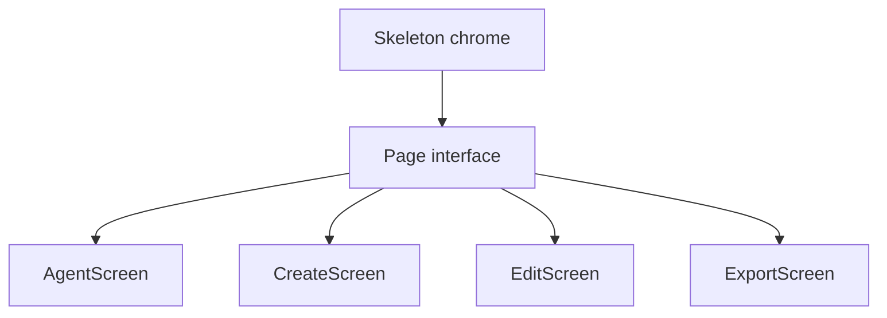

# TUI Architecture

This document describes the sshush TUI architecture: model hierarchy, message flow, component mapping, and Init/Update/View responsibilities.

See also: [Config](config.md) | [Setup](setup.md)

## Model Hierarchy



Text view:

```
Skeleton (chrome only)
├── AgentScreen   (page id "agent")
├── CreateScreen  (page id "create")
├── EditScreen    (page id "edit")
└── ExportScreen  (page id "export")
```

- **Skeleton**: Tabs, theme picker, help overlay, outer border/footer. Routes keys/mouse to the active page. Does not own daemon button logic (see `agent_chrome.go`).
- **AgentScreen**: Keys table, found keys, file picker, passphrase. Implements `HeaderTools` and `GlobalHotkeys` (`s/x/r/L/u/d`).
- **CreateScreen / EditScreen / ExportScreen**: Forms and actions using shared `FocusRing`, `KeyMap`, `SectionWidth`, `ButtonRow`.

### Page contracts (`page.go`)

| Interface | Methods |
|-----------|---------|
| **Page** | `tea.Model`, `HasModal() bool`, `HasActiveTextInput() bool`, `StatusTextRaw() (string, bool)` |
| **HelpProvider** | `HelpEntries() []string` |
| **HeaderTools** | `HeaderToolsView(focused bool) string`, `HeaderToolsFocused() bool`, `HeaderToolsUpdate(msg tea.Msg) tea.Cmd`, `HeaderToolsHandleMouse(x, y int) (handled bool, cmd tea.Cmd)` |
| **GlobalHotkeys** | `HandleGlobalKey(key string, pageActive bool) (handled bool, cmd tea.Cmd, side tea.Msg)` |
| **AsyncMsgRouter** | `HandlesAsync(msg tea.Msg) bool` |
| **ScreenEnter** | `OnScreenEnter()` |

`side` from `HandleGlobalKey` is a chrome message Skeleton applies in the same Update turn (e.g. `ActivateHeaderToolsMsg`). `VaultStateMsg` is unidirectional Agent → Skeleton for the footer vault padlock.

Chrome nav focus for header tools is `navFocusHeaderTools` (`navFocusDaemon` remains an alias for older tests).

## Event order

1. Help / theme overlays (Skeleton)
2. Modal open on active page → page owns keys (except ctrl+c)
3. Header tools focused (`navFocusHeaderTools`) → `HeaderToolsUpdate`
4. Global hotkeys (`HandleGlobalKey`) when not in text input / theme-picker save conflict
5. Tab bar chrome keys, else forward to active page `Update` (screen FocusRing / custom focus)
6. Async messages → pages that `HandlesAsync(msg)` (else active page)

Mouse: chrome zones first; then `HeaderToolsHandleMouse` (handled miss returns `false`); else page.

## Focus and keys

- **FocusRing** (`focus.go`): index-based slots via `NewFocusRing(n)`, `SetSkip`, `SetIndex`, `Next` / `Prev` (and no-wrap variants). Create/Edit/Export use this; they do not store `Focusable` items. `Focusable` exists for optional richer wrappers later.
- **KeyMap** (`keymap.go`): shared bindings (`KeyUp`/`KeyDown`/…, daemon keys). Prefer `KeyMatches` / `KeyMatchesString` over raw string switches.
- **Layout** (`layout.go`): `ContentWidth`, `SectionWidth` (3/4 content, clamp 60–120), `SectionInnerWidth`, `SectionGap`.

Zone IDs: `{pagePrefix}{kind}-{id}` (e.g. ButtonRow `ZonePrefix+label`, agent rows `{prefix}key-N`).

## Testing

- **Package `tui`**: Update-injection tests next to screens (`agent_nav_test.go`, `create_test.go`, `edit_test.go`, `export_focus_test.go` / `export_nav_test.go`, `focus_test.go`, `skeleton_footer_test.go`).
- **`internal/tui/tuittest`**: harness for external packages that must import `tui` without cycles (`Harness.Send` / `Resize` / `Key`, `WaitForZone`).

Official Charm `teatest` targets Bubbletea v1; this project uses Bubbletea v2, so keep Update-injection until a v2-compatible path exists.

## Message Flow

Messages flow from tea.Cmd functions to Update. Custom message types carry async results.

### Chrome

| Message | Purpose |
|---------|---------|
| NavToTabBarMsg | Move focus to tab bar |
| ActivateHeaderToolsMsg | Focus header tools / ensure agent tab |
| ExitHeaderToolsMsg | Leave header tools; restore prior tab |
| VaultStateMsg | Footer vault lock display (Agent → Skeleton) |
| ThemeChangedMsg | Refresh styles on all pages |

### Agent Screen

| Message | Source Cmd | Purpose |
|---------|------------|---------|
| agentKeysMsg | fetchAgentKeysCmd | Keys loaded from socket (or error) |
| agentStatusMsg | start/stop/reload/add/remove cmds | Status text for banner |
| agentDaemonStateMsg | checkDaemonCmd | Daemon running/stopped |
| foundKeysMsg | discoverKeysCmd | Discovered key paths |
| agentLockResultMsg / agentUnlockResultMsg | lock/unlock cmds | Lock results |
| ButtonFlashDoneMsg | ButtonFlashCmd | Button flash done |

### Create / Edit / Export

| Screen | Messages |
|--------|----------|
| Create | keyGenDoneMsg |
| Edit | editKeyLoadedMsg, editSaveMsg |
| Export | exportKeyLoadedMsg, exportAgentKeysMsg, exportCopyMsg, exportSaveMsg |

## Component Mapping

| Component | Package | Used In | Purpose |
|-----------|---------|---------|---------|
| table | charm.land/bubbles/v2/table | Agent, Edit, Export | Key lists |
| textinput | charm.land/bubbles/v2/textinput | Create, Edit, Export, Agent pass | Fields |
| filepicker | bubbles | Agent, Edit, Export | Select key files |
| ButtonRow | internal/tui | All screens | Action buttons |
| KeyTable | internal/tui | Agent, Edit, Export | Table + zones |
| FocusRing | internal/tui | Create, Edit, Export | Focus order |
| Lipgloss | charm.land/lipgloss/v2 | theme + View | Styling |

## Init / Update / View Responsibilities

### Skeleton

- **Init**: Batches Init() of all pages.
- **Update**: Chrome (tabs, theme, help, `navFocusHeaderTools`). Applies `VaultStateMsg` to footer. Forwards via Page / HeaderTools / GlobalHotkeys / AsyncMsgRouter (`agent_chrome.go` for Agent).
- **View**: Tab bar + optional `HeaderToolsView`, footer, help; body = active page View.

### AgentScreen

- **Init**: fetch keys, daemon, vault, discover.
- **Update**: agent msgs, table/found/passphrase/file picker.
- **View**: Loaded keys (centered), found keys; modals when active.
- **Header tools**: entered with `d` (unless removing a selected loaded key). `s/x/r/L/u` work from any tab via GlobalHotkeys.

| Key | Table focused | Found Keys focused |
|-----|---------------|-------------------|
| `up` / `k` | Cursor up; at first row → tab bar | Up; at top → table |
| `down` / `j` | Cursor down; at last → Found Keys | Down (clamped) |
| `backspace` / `delete` / `d` | Remove selected key | — |
| Click row | Select row | Click found line adds key |

### CreateScreen

FocusRing: Type → Options (skip for ed25519) → Comment → Dir → Filename → Save.

### EditScreen

FocusRing: Select file → Comment → Save (comment/save skipped until a key is loaded).

### ExportScreen

FocusRing: Load file → Load agent → (agent table modal) → Pub key → Copy → Save. Copy/Save use `ButtonRow`.
